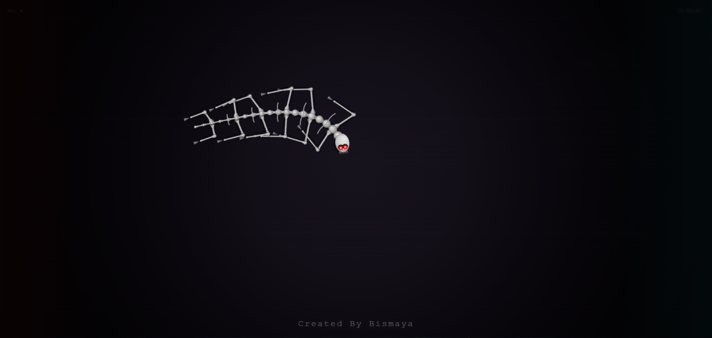

# 📼 Grim Motion


<p align="center">
  
</p>

> A retro-styled, atmospheric visual experience featuring procedural motion and VHS aesthetics.

## ✨ Overview

**Grim Motion** is a creative web experiment that simulates a gritty, old-school VHS recording. It combines procedural animation with CSS-based post-processing effects to create an eerie and immersive visual style.

## 🎨 Features

-   **VHS Aesthetics**: Authentic flicker, scanlines, and noise overlays.
-   **Chromatic Aberration**: Simulates lens distortion and color bleeding.
-   **Procedural Animation**: Dynamic movement powered by `creature.js`.
-   **Responsive Design**: Adapts to different screen sizes.

## 🚀 Getting Started

1.  Clone the repository:
    ```bash
    git clone https://github.com/dukebismaya/GrimMotion.git
    ```
2.  Navigate to the project directory.
3.  Open `index.html` in your favorite web browser.

## 🛠️ Technologies Used

-   **HTML5 Canvas**: For rendering the core visuals.
-   **CSS3**: For the VHS overlay effects (scanlines, flicker, noise).
-   **JavaScript**: For the logic behind the motion and interactivity.

## 👤 Author & Credits

Created and designed by **Bismaya Jyti Dalei**.

If you use this code or parts of it in your own projects, please credit the original creator.

---

<p align="center">
  <i>"Created By Bismaya"</i>
</p>
